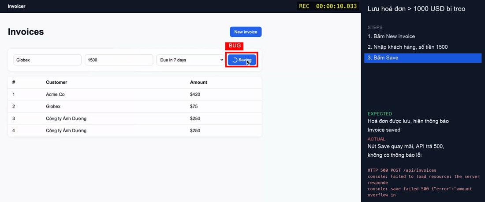

# web-video

A [Claude Code](https://claude.com/claude-code) skill (and a plain CLI) that **records and auto-edits short, focused screen videos of a web app**. It has two modes:

- **`feature-demo`**: a polished walkthrough for the client who ordered a feature. It has a visible cursor, click ripples, zoom on each click, numbered captions, an intro/outro card and an optional voiceover (local Vietnamese voice included).
- **`bug-report`**: a QA repro clip for developers, under 60 s. It has a steps panel, a true-time `REC` timestamp, the bug moment frozen with a red box, EXPECTED vs ACTUAL, and the console/HTTP errors. It ships with a redacted Playwright trace, a HAR and a ready `bug-report.md`.

Works on **macOS, Windows and Linux**. Everything runs locally; nothing is uploaded.

| feature-demo | bug-report |
|---|---|
|  |  |

## How it works

```
storyboard.yaml ─▶ record.py (Playwright take + event log + sync flash) ─▶ edl.py (event log → edit decisions → one ffmpeg graph)
                ─▶ verify.py (probe checks + contact sheet) ─▶ export.py (≤ 9 MB H.264) ─▶ report.py / redact.py
```

The take logs every step, click, keystroke and error with a timestamp. The editor uses that log to keep about 1 s around each action, speed up idle time (spinners, page loads), cut hidden steps such as the login, hold captions long enough to read, zoom on clicks and freeze the bug moment. Fragile parts are tested scripts, not prose: clock sync, frame-exact cuts, filter quoting and secret redaction.

## Requirements

- Python 3.10+
- ffmpeg with `drawtext`, `zoompan` and `subtitles`. Get it with `brew install ffmpeg` (macOS), `winget install Gyan.FFmpeg` (Windows) or `sudo apt install ffmpeg` (Linux).
- Python packages from `requirements.txt`: Playwright, PyYAML, Pillow. Chromium is installed through Playwright.
- Optional: the local Vietnamese voice (about 200 MB, downloaded by `install_tts.py`).

## Install

```bash
git clone https://github.com/vulh1209/web-video-skill.git ~/.claude/skills/web-video     # Windows (Git Bash): same path under %USERPROFILE%
cd ~/.claude/skills/web-video
python install.py --deps --tts                           # deps + Chromium + Vietnamese voice + `web-video` command
python scripts/selftest.py                               # ~1 min end-to-end check on the bundled demo app
```

`install.py` copies or links the skill into `~/.claude/skills/web-video`. It also adds a `web-video` command to `~/.local/bin`, plus `web-video.cmd` on Windows. If that folder is not on your PATH, it prints the line to add. Use `python install.py --link` to develop from a clone somewhere else, and `python install.py --uninstall` to remove it.

## Use it in Claude Code

Just ask, in any project:

> "Quay video hướng dẫn tính năng tạo hoá đơn trên http://localhost:3000 cho khách"
> "Record a bug repro: saving an invoice over 1000 USD spins forever"

Claude asks for anything missing in one message. It writes a storyboard and shows it to you for approval, then rehearses, records, edits, checks the frames and shows you a 480p draft. It renders the final only after you approve.

## Use it from a terminal

```bash
web-video new feature-demo storyboard.yaml   # start from an example, then edit url/steps
web-video discover storyboard.yaml           # list selectors on each page
web-video rehearse storyboard.yaml           # run the steps without video, fail loudly
web-video make storyboard.yaml --slug invoice-demo
# -> video-out/invoice-demo/v1/final.mp4, summary.txt (or bug-report.md), verify/contact.png
web-video help
```

A minimal storyboard:

```yaml
mode: feature-demo            # or bug-report (then add bug: {expected, actual} and `bug: true` on a step)
url: http://localhost:3000
lang: vi
title: "Tạo hoá đơn mới"
steps:
  - {caption: "Đăng nhập", hidden: true, do: ["goto /login", "fill #email | qa@example.com", "fill #password | <test password>", "click button[type=submit]"]}
  - {caption: "Bấm New invoice", do: 'click [data-testid="new-invoice"]'}
  - {caption: "Nhập khách hàng và số tiền", do: ["type #customer | Globex", "type #amount | 250"]}
  - {caption: "Lưu: hoá đơn hiện ngay trong danh sách", do: ["click #save", "expect .toast"], wait: 1500}
```

The full schema and all 13 actions are in [references/storyboard.md](references/storyboard.md). Note: quote any action that contains `#`, because YAML treats it as a comment.

## Privacy and secrets

- Use **test accounts** or a Playwright `storage_state` file. Don't put real passwords in storyboards you share; `*.local.yaml`, `*.secret.yaml` and `auth*.json` are git-ignored.
- `redact.py` masks auth headers, cookies, secret-looking fields and query params. It also masks **every value the storyboard typed into a secret field**, because Playwright traces record `fill()` values verbatim. Share only the `*.redacted.*` files.
- Pixels are not redacted. Check `verify/contact.png` before you share a video.
- Narration is local by default. Cloud TTS (OpenAI, ElevenLabs) needs `--allow-cloud`.
- `video-out/` (videos, HAR, traces) is git-ignored.

## Vietnamese voice

`install_tts.py` installs Piper **"csa-voice v3"** by CakeByVPBank (MIT, five voices: `ngoclan`, `minhanh`, `thuha`, `yennhi`, `quanghuy`). The model is fetched from Hugging Face at a pinned commit and runs on CPU with [sherpa-onnx](https://github.com/k2-fsa/sherpa-onnx) (Apache-2.0). It renders about 20× faster than real time. Numbers, `%`, `$` and `đ` are spelled out in Vietnamese. English UI words sound accented, so prefer the Vietnamese label or a phonetic spelling in `say:`. On macOS without the model, the skill falls back to `say -v Linh`.

The model's training lineage is only partly documented (see its model card). Check it yourself before using the voice in large commercial work. This is not legal advice.

## Project layout

```
SKILL.md                 instructions Claude follows (≤ 200 lines)
references/              details loaded on demand (storyboard, record, EDL/ffmpeg, overlays, verify, bug-report, export, failures, hi-fi capture)
scripts/                 record, calibrate, edl, overlay, tts, install_tts, piper_worker, verify, export, redact, report, web_video, selftest, lint_skill
assets/fixture/          tiny invoice app with a deliberate bug (used by selftest and the examples)
assets/examples/         feature-demo.yaml, bug-report.yaml
tests/                   unit tests (python -m unittest discover -s tests)
install.py               installer for the skill + CLI
```

## Development

```bash
python -m unittest discover -s tests     # unit tests (pure Python)
python scripts/lint_skill.py             # SKILL.md size, every referenced path exists, scripts run --help
python scripts/selftest.py               # end-to-end on the fixture app, both modes
```

CI runs the unit tests, lint and the end-to-end selftest on Ubuntu, macOS and Windows. It uploads the produced videos as artifacts.

## Limitations

- Playwright's `record_video` is about 25 fps VP8 at CSS-pixel size. That is fine at 720p; see [references/hifi-capture.md](references/hifi-capture.md) for sharper options.
- The DOM cursor cannot show over native dropdowns, file pickers or OS dialogs.
- `gh issue comment --attach` needs gh ≥ 2.99. Posting anything always needs your explicit yes.

## Licence

MIT, see [LICENSE](LICENSE). Third-party components are downloaded at install time and keep their own licences: Playwright (Apache-2.0), ffmpeg (LGPL/GPL, depending on the build), sherpa-onnx (Apache-2.0), the Piper voice model (MIT) and espeak-ng data (GPL-3.0, used as data by sherpa-onnx).

---

### Hướng dẫn nhanh (tiếng Việt)

1. Cài: `git clone https://github.com/vulh1209/web-video-skill.git ~/.claude/skills/web-video && cd ~/.claude/skills/web-video && python install.py --deps --tts`
2. Kiểm tra: `python scripts/selftest.py`.
3. Trong Claude Code, nói: "quay video hướng dẫn tính năng X trên localhost:3000 cho khách" hoặc "quay lại bug Y cho dev".
4. Ngoài terminal: `web-video new feature-demo sb.yaml`, sửa file, rồi chạy `web-video make sb.yaml --slug ten-video`.
5. Kết quả nằm ở `video-out/<slug>/v<N>/`: `final.mp4`, `summary.txt` hoặc `bug-report.md`, và `verify/contact.png`.
